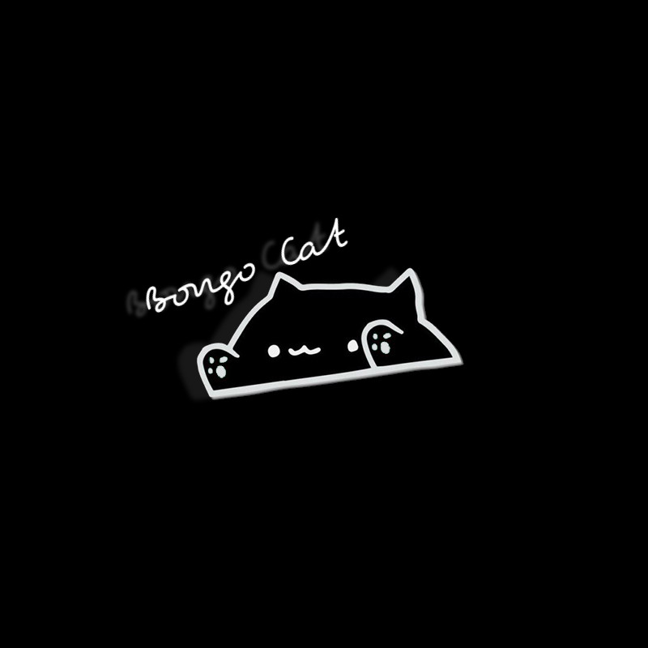

<!-- TOP OF README ANCHOR -->
<a name="top"></a>
project is still in development :)
<!-- PROJECT LOGO -->
<br/>
<div align="center">
  <a href="https://github.com/ZackeryRSmith/bongocat-osu/">
    
  </a>

<h3 align="center">Bongocat-Osu</h3>
  <p align="center">
    Click 'em circles in <i>style</i>!
    <br/>
    <a href="https://github.com/kuroni/bongocat-osu"><strong>Original Project</strong></a>
    <br/><br/>
    <a href="https://github.com/ZackeryRSmith/bongocat-osu/issues">Report Bug</a>
    ·
    <a href="https://github.com/ZackeryRSmith/bongocat-osu/issues">Request Feature</a>
  </p>
</div>


## Description
A Bongo Cat overlay with smooth paw movement and simple skinning ability, written in C++, for osu! *This project is an improved fork* as the original project has lost support from the developers. 83 unsolved issues and counting! This project aims to implement nearly all feature requests present in the original project. Along with fixing some bugs.

## Further information
Press Ctrl + R to reload configuration and images (will only reload configurations when the window is focused).

Supported operating system:
* Windows
* Linux

_Note_: If you're using WINE on Linux, make sure that osu! and this application run in the same `WINEPREFIX`.
          Though I highly recommend you use Osu!Lazer if you are on linux.

## For developers
This project uses [SFML](https://www.sfml-dev.org/index.php) and [JsonCpp](https://github.com/open-source-parsers/jsoncpp). JsonCpp libraries are directly included in the source using the provided `amalgamation.py` from the developers.

### Libraries and dependency

#### Windows and MinGW
To build the source, download the SFML libraries [here](https://www.sfml-dev.org/index.php), copy `Makefile.windows` to `Makefile`, then replace *`<SFML-folder>`* in `Makefile` with the desired folder.

#### Linux
You need to have these dependencies installed. Check with your package manager for the exact name of these dependencies on your distro:
- g++
- libxdo
- sdl2
- sfml
- x11
- xrandr

Then, copy `Makefile.linux` to `Makefile`.

### Building and testing
To build, run this command from the base directory:

```sh
make
```

To test the program, run this from the base directory:

```sh
make test
```

Alternatively, you can copy the newly-compiled `bin/bongo.exe` or `bin/bongo` into the base directory and execute it.

If you have troubles compiling, it can be due to version mismatch between your compiler and SFML. See [#43](https://github.com/kuroni/bongocat-osu/issues/43) for more information.

