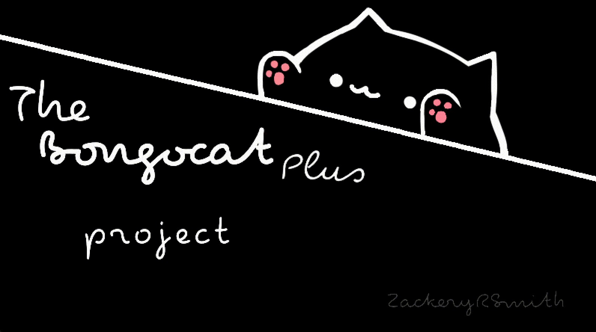

<!-- TOP OF README ANCHOR -->
<a name="top"></a>

> [!NOTE]
the state of the refactor is not current with the in-dev branch... *so then why is this (refactor) the default?*

> Simply because I believe it's more indicative of this projects direction. If you want a version of Bongocat-Plus
that's fully complete. Please check out [in-dev](https://github.com/ZackeryRSmith/bongocat-plus/tree/in-dev)

<!-- PROJECT LOGO -->
<br/>
<div align="center">
  <a href="https://github.com/ZackeryRSmith/bongocat-plus/tree/refactor/cats/plus">
    
  </a>

<!-- BUILD STATUS' -->
<p align="center">
  
  <!---->
  <!---->
  
  <!---->
  <!---->
  <!---->
  <!---->
  
</p>

<h3 align="center">Bongocat Plus</h3>
  <p align="center">
    The extensible and highly configurable Bongo Cat overlay!
    <br/>
    <a href="https://github.com/kuroni/bongocat-osu"><strong>Original Project</strong></a>
    <br/><br/>
    <a href="https://github.com/ZackeryRSmith/bongocat-plus/issues">Report Bug</a>
    ·
    <a href="https://github.com/ZackeryRSmith/bongocat-plus/issues">Request Feature</a>
  </p>
  
  
</div>

<!-- TABLE OF CONTENTS -->
<details>
  <summary>Table of Contents</summary>
  <ol>
    <li><a href="#about-the-project">About The Project</a></li>
    <li><a href="#additional-information">Additional Information</a></li>
    <li><a href="#contributing">Contributing</a></li>
    <ul>
      <li><a href="#building-and-testing">Building and Testing</a></li>
      <ul>
          <li><a href="#windows">Windows</a></li>
          <li><a href="#macosx">Windows</a></li>
          <li><a href="#linux">Linux</a></li>
      </ul>
    </ul>
    <li><a href="#acknowledgments">Acknowledgments</a></li>
  </ol>
</details>

## About the Project
A Bongo Cat overlay with smooth paw movement and simple skinning ability, written in C++, for osu! *This project is an improved fork* as the original project has lost support from the developers (80+ unsolved issues). This project aims to implement nearly all feature requests present in the original project. Along with fixing some bugs.

## Additional Information
Press Ctrl + R to reload configuration and images (will only reload configurations when the window is focused).

Supported operating system:
* Windows
* MacOSX
* Linux

**_Note_**: If you're using WINE to run Osu make sure that this application runs under the same `WINEPREFIX`.
          Though I highly recommend you use Osu!Lazer if you are on MaxOSX, or linux to avoid WINE.

## Contributing
This project uses [SFML](https://www.sfml-dev.org/index.php) and [JsonCpp](https://github.com/open-source-parsers/jsoncpp). JsonCpp libraries are directly included in the source using the provided `amalgamation.py` from the developers. See below on how to compile bongocat-plus

### Building and Testing
#### Windows
Download the SFML library [here](https://www.sfml-dev.org/index.php), once done and extracted, clone this repository `git clone https://github.com/ZackeryRSmith/bongocat-plus && cd bongocat-plus`. If you don't already have it, install [CMake](https://cmake.org/). Now run the following commands to build bongocat-plus

```
mkdir build
cmake -S . -B build -DCMAKE_BUILD_TYPE=Debug -DSFML_ROOT=/path/to/SFML <-- BE SURE TO CHANGE THIS TO THE PATH OF YOUR SFML INSTALLATION
cd build && make
```

Boom, you have just compiled bongocat-plus.

#### MacOSX
To make life much easier for you I'd recommend you install [brew](https://brew.sh/); a package manager for MacOSX. Once installed run `brew install sfml` and `brew install xquartz`. Once done, clone the bongocat-plus repository `git clone https://github.com/ZackeryRSmith/bongocat-plus && cd bongocat-plus`. Now run the following commands to build bongo-cat

```
mkdir build
cmake -S . -B build -DCMAKE_BUILD_TYPE=Debug
cd build && make
```

Boom, you have just compiled bongocat-plus.

#### Linux
You need to have these dependencies installed. Check with your package manager for the exact name of these dependencies on your distro:
- g++
- libxdo
- sdl2
- sfml
- x11
- xrandr

Now clone this repository and run the following commands to build bongocat-plus

```
mkdir build
cmake -S . -B build -DCMAKE_BUILD_TYPE=Debug
cd build && make
```

**If you have troubles compiling, it can be due to version mismatch between your compiler and SFML. See [bongocat-osu#43](https://github.com/kuroni/bongocat-osu/issues/43) for more information.**

## Acknowledgments
*  [HamishDuncanson](https://github.com/HamishDuncanson)
*  [kuroni](https://github.com/kuroni)
*  [CSaratakij](https://github.com/CSaratakij)
*  [Kuvster](https://github.com/Kuvster)
*  [Einar145](https://github.com/Einar145)
